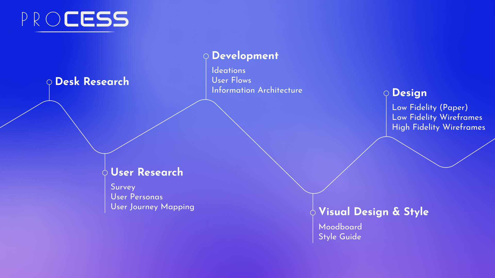
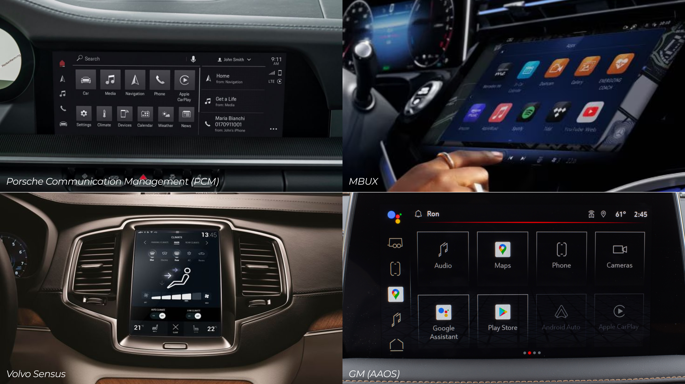
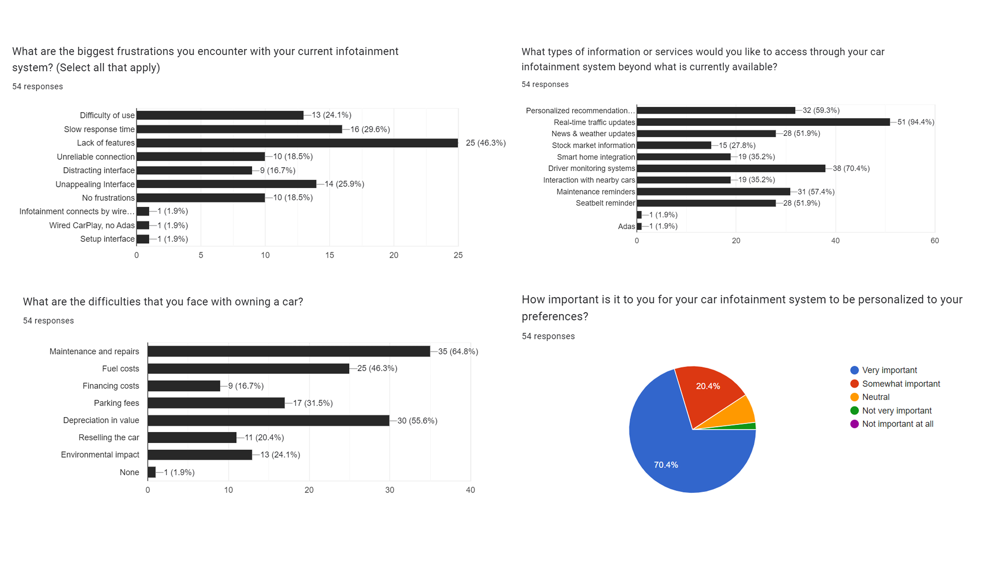
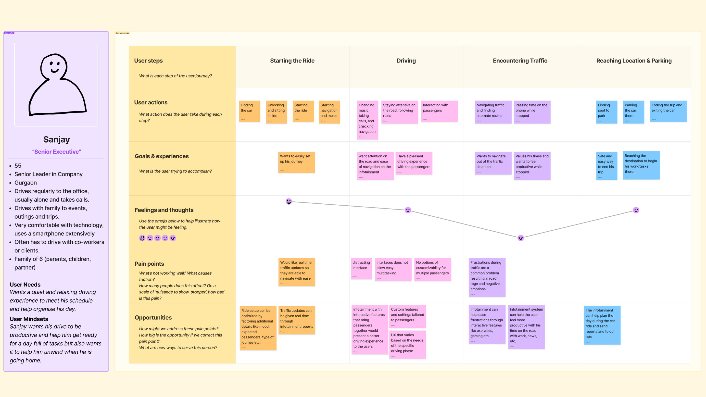
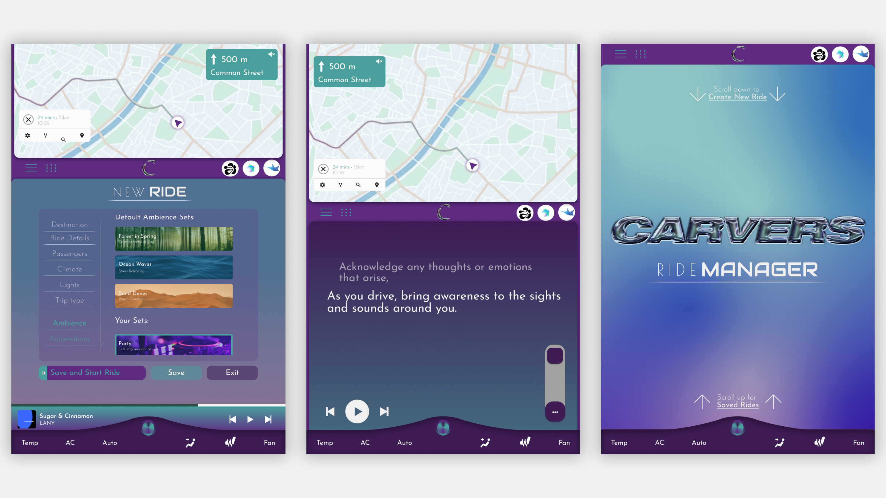
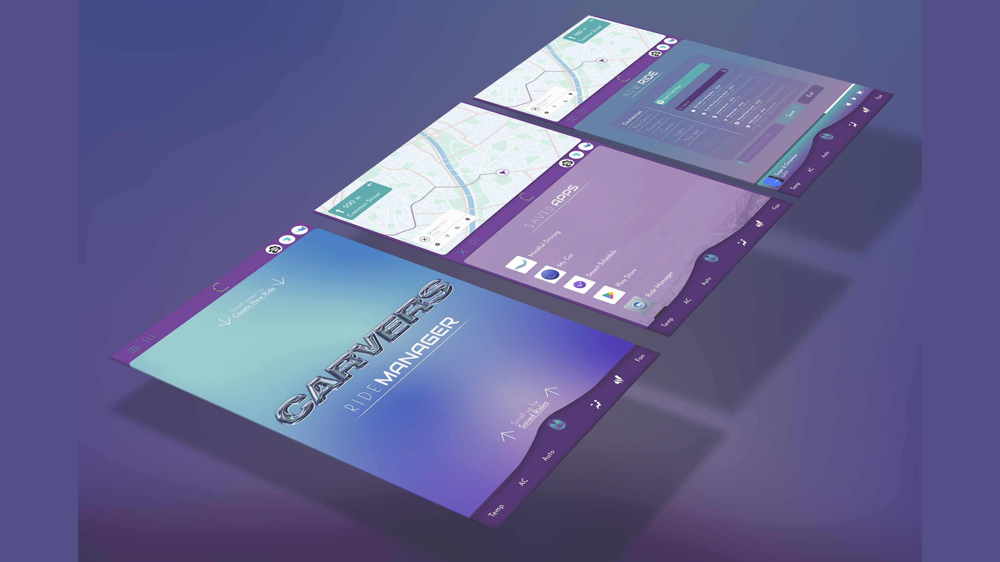

# Carvers

Designing for a productive and unique driving experience through an Infotainment system while ensuring road safety and driver concentration.

# The Challenge

### Rethinking the experience of driving a car

My interest in the domain of UX for automobiles began from a simple realisation that a car is nothing but a small metal enclosure that forces a kind of proximity among people that is rare to find today. This presents a plethora of frustrations (especially if you drive on Indian roads) but also opportunities where design could intervene.

#### The average driver will spend over 4 years of their life behind the wheel [_(Worldmetrics)_](https://worldmetrics.org/time-spent-driving-statistics/).

We spend a big portion of our lives in cars. But are users getting the experience they deserve? I started this project with a veiw that Infotainment systems can do a lot more to deliver unique experiences to drivers and passengers.

This project was my introduction to the UX design process. I followed a very standard process from research to prototypint and implemented various tools and techniques.

## Understanding the market

### What are the current infotainment systems and what do they offer?

To kick off the project, I began by understanding and categorizing existing infotainment systems:

1.  **Proprietary Systems:** Developed by in-house software teams at automobile companies. This has been the industry standard for all major car brands.
    
2.  **Automotive OS Platforms:** Customizable platforms to build experiences over. Tech giants like Google, Linux and Blackberry are building these softwares for car makers.
    
3.  **Screen Mirroring Softwares:** Softwares like Android Auto and Apple Car Play enable mobile screen sharing on infotainment screens.
    

#### Auto makers don't want to build their own systems anymore

> A shift is occurring as more car makers, including giants like Volvo and Porsche, move from proprietary software to OS platforms due to their convenience and cost-effective development.
> 
> This trend provides an opportunity to leverage these platforms to **develop new and unique driving experiences that would make cars stand out** in a competitive industry.

## Choosing the Platform

### Why Google's AAOS?

### Google makes the platform, car makers fine tune it to their brand experience.

I chose to work over Google's AAOS platform to build an infotainment system that provided a uniquely assistive driving experience.

To do this, I studied the existing infotainment systems and the features. I categorised the features in to three major buckets:

1.  Must have features: These include navigation, audio media playback, climate control, vehicle information and other essential features.
    
2.  Common features: Most car models, unless they are the very base model, have these features. They include phone mirroring, parking assistance, custom themes, digital instrument clusters and so.
    
3.  Uncommon features: These were the features found in luxury car systems like the Porsche Communication Management (PCM) and MBUX OS. Features like predictive maintainance, ADAS, biometric authentication, driver profiles, AR navigation and in-car entertainment were already produced or in development.
    

With this understanding, user research was conducted to undestand the pains and gains of car buyers, especially those in the luxury segment who expect the best performance and features from their vehicles and are able to pay for them.

## User Research and Analysis

### Understanding Drivers’ Needs

I (along with a teammate working on a similar project for economical cars) surveyed 55 car owners across the spectrum. The goal was to understand the features that users interacted with the most while driving and the pain points in their driving experience.

Due to limited resourses, I was not able to conduct more extensive user research with dealerships and high end car buyers. Online user data (Netnography) was a substitute tool that allowed me to understand user sentiments and pains of this segment.

#### Drivers just need more from their cars.

The research provided valuable insights into the driving experiences and preferences of car owners. Key findings from the survey and netnography included:

1.  **High Interaction Features**: Drivers frequently used navigation, music streaming, and hands-free calling. These features were deemed essential for a seamless driving experience.
    
2.  **Modern and efficient**: Common frustrations included complicated user interfaces, slow response times, and distractions caused by poorly designed infotainment systems. Drivers expressed a strong need for intuitive, easy-to-use systems that minimized distraction.
    
3.  **Productivity Tools**: There was a significant interest in features that could enhance productivity, such as calendar integration, email access, and voice-activated assistants, provided they did not compromise safety. Common problems faced by car owners like maintainance and fuel could also be managed through the system itself.
    
4.  **Safe**: Users emphasized the importance of safety, advocating for systems that offer clear navigation, heirarchy, and minimal touch interactions to reduce distraction.
    

#### Addressing the Digital-Tactile Dilemma: Why Digital Interfaces Prevail

A major sentiment discovered online was how users preferred tactile control systems and simple infotainment system. This raises the question; why are car makers investing so heavily in digital interfaces when many users demanded tactile control over their cars?

This was because digital infotainment systems were much easy to manufacture, assemble, repair and replace in cars compared to tactile switches that need to be individually designed and manufactured. Revamping the driving experience also becomes easier with a digital infotainment system compared to physical dials where new moulds would need to be made for any changes.

### Digital saves money but is it providing the best experience?

> So, these systems aren't going anywhere. But a lot needs to be done in improving the user experience through these systems. My findings guided the development of an infotainment system that needs to be intuitive, simple but comprehensive and enable a more personalised experience.

## Developing the Solution

### An Infotainment system that cares about the drivers time and experience.

The research informed the development of an infotainment system that is:

-   **Intuitive:** Easy to navigate and use.
    
-   **Simple but Comprehensive:** Covers essential features without overwhelming the user.
    
-   **Personalized:** Tailored to enhance the individual driving experience.
    

By understanding the market and drivers' needs, the is aim to create an infotainment system that stands out in the automotive industry.

## From Research to Concept

The results of user research were distilled into user personas and empathy maps, enhancing my understanding of user perspectives.

The user journeys built for the personas helped to reveal points of intervention and opportunities.

With a comprihensive understanding of the experience, and a list of potential opportunities to the pain points in the processes, I got to ideating my system and its features. For this, I designed a custom tool to help me gain deeper insights and a wider range of ideas.

The ideation process led to the final concept, and I developed user flows to integrate the proposed design interventions into the driving experience.

The user flows allowed me to build an information archetecture that covered the entire infotainment system and its offerings.

## User Interface development

### Conceptualizing the User Interface

Guided by the information architecture, I began with low-fidelity sketches on paper to ideate the interface's look and feel. The wireframes illustrate the UI concept, incorporating various grid layouts that adapt based on the driver’s speed and concentration levels. The design aims to be efficient, facilitating multitasking while minimizing cognitive load.

### 53% of surveyed drivers reported boredom or monotonous driving during their commutes.

The Interface aims to guide and assist the user in every stage of the driving process and helps them make best use of their time in the car through apps like Schedule Manager and Mindful Driving.

#### Style and aesthetics

To start the design process, I began by creating a moodboard with the help of a fashion student to explore various styles and elements. We collected a wide range of images, textures, color palettes, typography examples, and interface designs from various sources. This included existing infotainment systems, automotive design trends, contemporary UI/UX patterns, and even fashion and technology inspirations.

### Creating an elegant, futuristic and sophisticated system

> The visual appeal is crucial in the automobile space, significantly influencing buyers' purchase decisions. Hence, I focused heavily on the style and appearance of the interface, striving for an elegant yet contemporary design that aligns with the concept of a new and smarter infotainment system.

-   **Typography:** I used a simple San-Serif typeface to ensure readability and complimented it with two fonts that brought character and appeal.
    
-   **Colours:** I designed both light and dark color schemes to ensure appropriate screen visibility while driving, thus avoiding distractions. Bold colors and gradients were used to create a sense of uniqueness in the design.
    
-   **Spacing:** To ensure a visually coherent layout, I used multiples of 25 px for spacing, avoiding a randomly placed look.
    

I created various reusable and responsive components for my design keeping both my colour schemes in mind. I see this as the beginnings of a design system for AAOS powerd infotainment systems.

## Final Design

The final interface design incorporates a selection of features from the information architecture, focusing primarily on ride optimization. This segment of the system addresses key aspects such as navigation, ride start, and driving assistance, all aimed at enhancing the overall driving experience.

## Ride Setup

Setup and save frequent rides with minute control over the ambience, climate and passengers of the trip. This allows users to customise their experience for regular journeys like "commute" or "picking up the kids".

## Mindful Driving

This app can be configured to allow for regular reflections and moments of mindulness in monotonous and often exhausting commutes, at the end of the day.

## Dark Mode

Providing a dark mode is not only makes the design more accessible but is also an absolute requirement according to Google's design for driving principles to ensure minimal driver distractions.

## App Library

Google's AAOS allows vehicles to come with a play store and the option to install various apps configured for infotainment systems. The design includes app libraries in multiple layouts to ensure easy switching and easy navigation when required.

## Reflection

#### Process, Process, & Process

This project showed the importance of a thorough process to me. Starting from a place of genuine interest allowed me to build a concept through a well-defined and intensive approach. The meticulous attention to each phase—research, ideation, and design—was crucial in shaping a meaningful and functional infotainment system. This experience has reinforced my belief in the value of a systematic process for achieving successful outcomes

#### Collaboration

Throughout the project, I sought to collaborate with students from relevant domains to enrich the development process. Engaging fashion and product designers provided diverse perspectives and instilled the importance of multidisciplinary collaboration.

#### Reflections on the Final Design

The final interface design successfully integrates key features focused on ride optimization, demonstrating the potential of the concept. However, it’s clear to me that the project is a starting point. Future development will be essential to fully realize the system’s potential, incorporating additional features and refining the user experience based on feedback.
